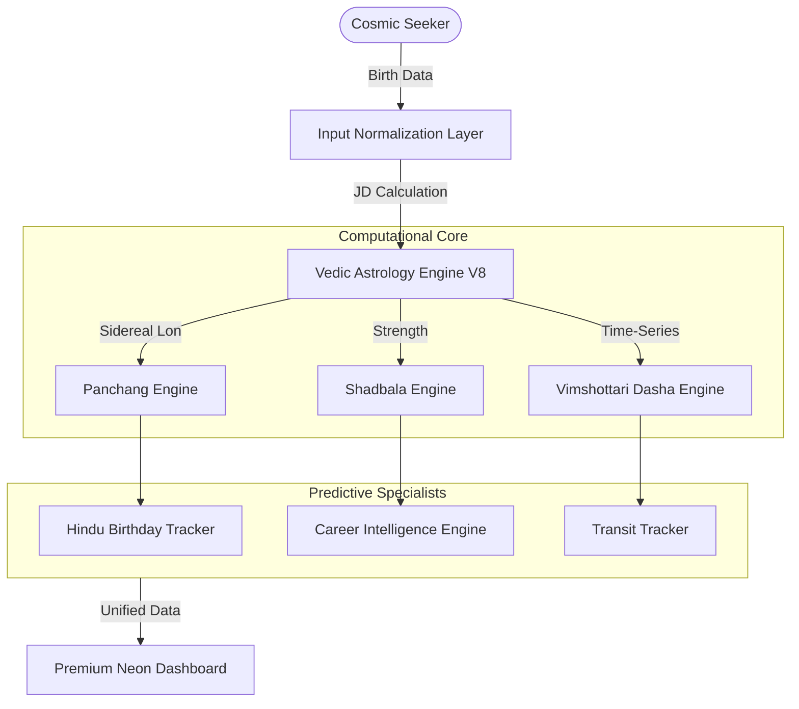

<div align="center">


# 🌌 AstroPsycho: The Celestial Intelligence Platform 🌌
### <div align="center">🔮 Ancient Wisdom Architecture &middot; AI-Driven Analysis &middot; Real-Time Celestial Math 🚀</div>

---

<p align="center">
  
  
  
</p>

[✨ **LAUNCH THE COSMIC DASHBOARD**](https://main.astropsycho.pages.dev)

</div>

---

## 🏗️ System Architecture (The "Astro-Stack")

AstroPsycho is built on a high-precision modular architecture that processes raw planetary ephemeris into psychological and predictive insights.



---

## 💎 Innovative Modules (High-Tech Features)

| Feature | Description | Tech Highlight |
| :--- | :--- | :--- |
| **🎂 Hindu Birthday Tracker** | Calculates the exact recurring birth Tithi (Lunar day) within the birth Solar month. | *Lookahead Iteration Logic* |
| **💼 Career Intelligence** | Maps Shadbala strengths and 10th Lord positioning to 150+ modern professions. | *Rule-based Planetary Mapping* |
| **🪐 Dynamic Dasha Timeline** | A high-fidelity visualization of Vimshottari cycles with sub-period precision. | *Temporal Math + CSS Grid* |
| **💪 Shadbala UI** | Detailed 6-fold planetary strength analysis presented through high-tech HUD cards. | *Precise Ephemeris Algorithms* |
| **✦ Rotating Branding** | A premium CSS-animated star logo that symbolizes the continuous motion of the cosmos. | *GPU-Accelerated Animations* |

---

## 🛠️ The Cosmic Tech Stack

### **Core Intelligence**
  

### **Visual Language**
  

### **Infrastructure**
  

---

## 🚀 Instant Deployment (Local Galaxy)

```bash
# Clone the repository
git clone https://github.com/ashishh-tech/AstroPsycho.git

# Enter the cosmic portal
cd AstroPsycho

# Launch the local star (any local server)
npx serve .
```

---

## 🤝 Project Governance

We welcome "High-Tech" contributions! Please refer to our:
- [🐛 Bug Report Template](.github/ISSUE_TEMPLATE/bug_report.yml)
- [🚀 Feature Request Template](.github/ISSUE_TEMPLATE/feature_request.yml)
- [🛡️ Contribution Guide](.github/PULL_REQUEST_TEMPLATE.md)

---

<div align="center">

*"The stars do not compel, they impel."* 🌠

**⭐ Star the repo if this celestial experience resonates with you! ⭐**


</div>
